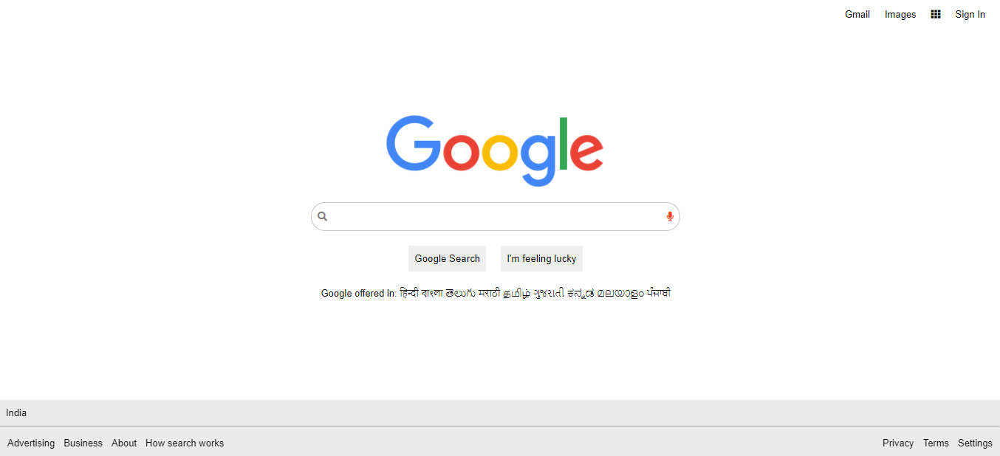

# google-search-clone
Project which is developed using HTML, CSS and Javascript(basic)

To view Project click on link:  <a href="https://raktisingal.github.io/google-search-clone">Launch Project</a>
 .............................................................................................................................................................................
 .............................................................................................................................................................................
 .............................................................................................................................................................................

Preview of Project :

 
 

